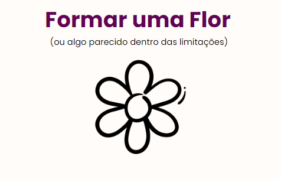
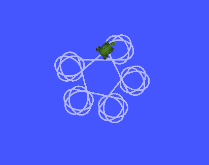

# Integração de ROS2 com Turtlesim

Este projeto tem como objetivo demonstrar a integração do ROS2 com o Turtlesim, fornecendo um exemplo de acionamento do Turtlesim e a execução de um script Python para controlá-lo. 

## Objetivo Especifico 
Conseguir controlar a trajetória de um node por meio de um Sript em Python responsável por formar a imagem de uma flor utilizando a trajetória de uma tartaruga. 

## Tecnologias Utilizadas

- ROS2: O ROS2 (Robot Operating System 2) é um framework para desenvolvimento de robôs que fornece um conjunto de ferramentas e bibliotecas para ajudar na construção de sistemas robóticos complexos.

- Turtlesim: O Turtlesim é um simulador gráfico que permite controlar uma tartaruga virtual em um ambiente 2D. É uma ferramenta usada para aprendizado e teste de programação de robôs no ROS.

## Acionamento do Turtlesim

Para acionar o Turtlesim, siga os passos abaixo:

1. Certifique-se de ter o ROS2 instalado em seu sistema.
2. Abra um terminal e execute o seguinte comando para iniciar o Turtlesim: 

`ros2 run turtlesim turtlesim_node` 

3. Uma janela gráfica será aberta, exibindo o simulador Turtlesim com a tartaruga no centro.

## Execução do Script Python

Para executar o script Python de controle do Turtlesim, siga os passos abaixo:

1. Certifique-se de estar na pasta correta do projeto. No terminal, navegue até o diretório: 
`cd turtlesim` 
2. Execute o seguinte comando para executar o script Python: 
`python3 main.py` 

Certifique-se de ter as dependências necessárias instaladas e configuradas corretamente.

## Resultados 
### Objetivo - Flor 

### Resultado Obtido - Flor 

## Demonstração

Confira a demonstração do funcionamento do projeto no seguinte link do YouTube: 
[Link da Demonstração](https://youtu.be/iMvbr3v2yCc)
