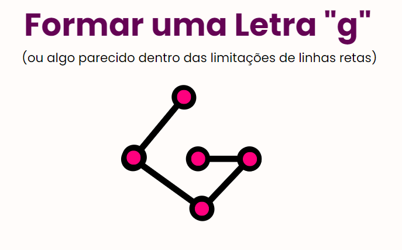
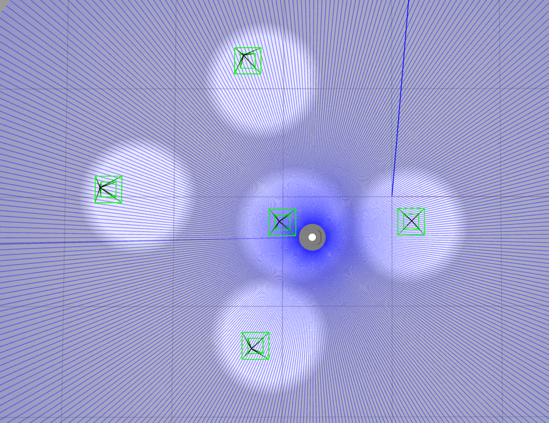

# Documentação do Projeto Turtlebot
Este é um projeto que utiliza o ROS 2 e o Gazebo para controlar o movimento de um robô Turtlebot3 em um ambiente simulado. O projeto consiste em classes e lógica para gerenciar a fila de pontos a serem seguidos pelo robô e controlar seu movimento.

## Funcionamento da Movimentação e Rotação
Para realizar o controle de movimento do robô por meio do ROS2, é necessário utilizar mensagens de Twist para definir as velocidades lineares e angulares. 

No entanto, devido às restrições de movimento do robô, é preciso calcular o vetor relativo entre a posição atual e a posição desejada, o que é feito por meio da transformação de bases de coordenadas. Com a determinação da rotação e translação necessárias, é possível programar o robô para se mover para um ponto específico. 

Além disso, ao implementar uma lógica de filas, é possível criar rotas completas de forma eficiente e automatizada, permitindo que o robô navegue por ambientes complexos. 

## Pré-requisitos
Antes de começar, certifique-se de ter instalado os seguintes componentes: 
✓ ROS 2 
✓ Gazebo 
✓ Turtlebot3 packages 

## Execução e Simulação
### Passo 1: Inicialização do Gazebo
Para iniciar o Gazebo com o mundo vazio e o Turtlebot3, execute o seguinte comando no terminal: 

`ros2 launch turtlebot3_gazebo empty_world.launch.py` 

Isso iniciará o Gazebo com o Turtlebot3 em um mundo vazio.

### Passo 2: Executando o Código Python
Para executar o código Python que controla o movimento do Turtlebot3, siga estas etapas:
- Abra um novo terminal.
- Navegue até o diretório do projeto:  
`ponderada2/control`
- Execute o seguinte comando: 
`python3 turtlebot.py` 
Aguarde até que o programa seja executado. 

## Resultado
Após seguir as etapas acima, o Turtlebot3 começará a se mover de acordo com a lógica implementada no código Python. 
Você pode visualizar a movimentação do robô no ambiente simulado do Gazebo.

### Objetivo de Rota 

### Rota Realizada

## Vídeo de Demonstração
[Demonstração de Funcionamento da Rota](https://youtu.be/2hcGTHepgBM)

## Considerações Finais
Este projeto demonstra a integração entre o ROS 2, o Gazebo e o Turtlebot3 para controlar o movimento de um robô em um ambiente simulado. Você pode personalizar a fila de pontos e a lógica de controle conforme necessário para atender aos requisitos do seu projeto.