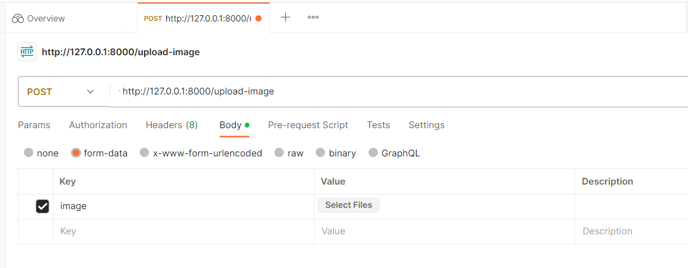
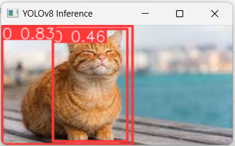

# Sistema de Visão Computacional 

## Objetivos do Projeto 
Capacidade demonstrável de interagir com imagens utilizando os conceitos de visão computacional e modelos preditivos pré-treinados. 

## Ultralytics - YoloV8
YOLO, que significa "You Only Look Once", é uma popular arquitetura de modelo pré-treinada para detecção de objetos. O YOLO reconhece objetos em uma imagem e classifica-os, além de fornecer a localização desses objetos através de "bounding boxes". O modelo foi projetado para ser extremamente rápido e preciso, fazendo dele uma escolha ideal para aplicações em tempo real.

## Roboflow
O Roboflow é uma plataforma online que permite que desenvolvedores criem seus próprios aplicativos de visão computacional. Ele fornece várias ferramentas necessárias para converter imagens em um modelo de visão computacional com treinamento personalizado para uso em aplicativos.

### Criação de Dataset 
Para desenvolver a aplicação de aprendizado de máquina para o projeto eu criei um projeto individual no Roboflow para entender como estruturar um dataset. Usando como referência um dataset pre-pronto de imagens de gatos separadas por treino, teste e validação. Fiz o upload desse dataset no Roboflow para utilizar meu projeto e meu dataset como referência para a entrega. 

[Link para o Projeto](https://universe.roboflow.com/gabrielainteli/cats_find)

## Requisitos
✓ Ultralytics 
✓ Roboflow 
✓ FastAPI  
✓ Uvicorn  
✓ Postman - Teste de Funcionamento  
✓ Fotos de Gatinhos 

## Passo a Passo 
1. Criação de Conta no Roboflow 
2. Criação de Dataset no Roboflow 
3. Instalação de Pacotes e Bibliotecas Necessários 
4. Treinamento e Teste do Modelo (Colab - https://colab.research.google.com/drive/1ljGORzEGB4epcRAinL5Jopd5CSKNO7zX?usp=sharing)
5. Criação de API: Foi desenvolvida uma API para o envio das imagens a serem analisadas com base no modelo treinado. 
6. Envio de Imagens para Identificação - Via Postman

## API - Envio de Imagens 
Por meio das bibliotecas: Uvicorn e Fastapi foi criado um servidor em python responsável pelo recebimento das imagens a serem utilizadas com base no modelo para a identificação de gatos. 

A API é estruturada com uma rota responsável pelo método POST da imagem e essa imagemutiliza como referência a estrutura desenvolvida pelo YoloV8 para entender a existência ou não dos elementos na imagem. 

Ao iniciar o servidor por meio do comando: 
`main.py` 

Podemos acessar a rota para testes utilizando o Postman, como indicado na imagem abaixo: 

Ao acessar a rota, indicamos que o body será composto de um form-data, que tem como key `image` e o value precisa estar no formato de arquivo. 

Em seguida para o `value`, ja pode ser realizado o upload de uma imagem que retornará a detecção dos elementos. Como indicado na sessão de Demonstração. 

## Demonstração 
### Modelo - Treino e Teste 

### Funcionamento 
 

[Vídeo de Demonstração do Funcionamento](https://youtu.be/O3qhWABqWgE) 

