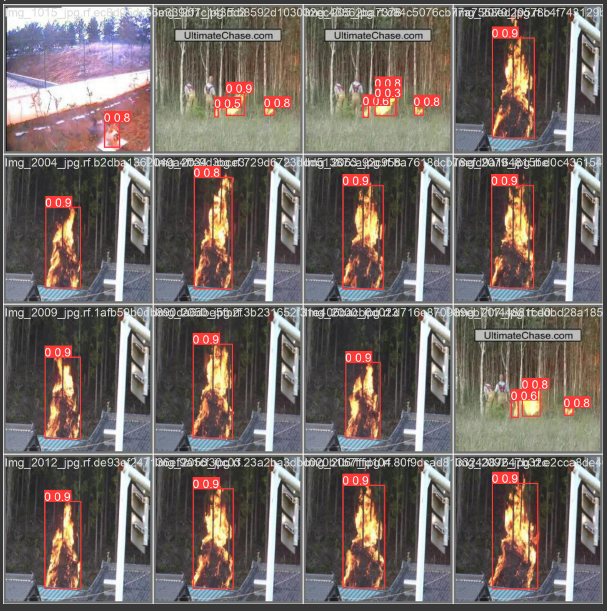
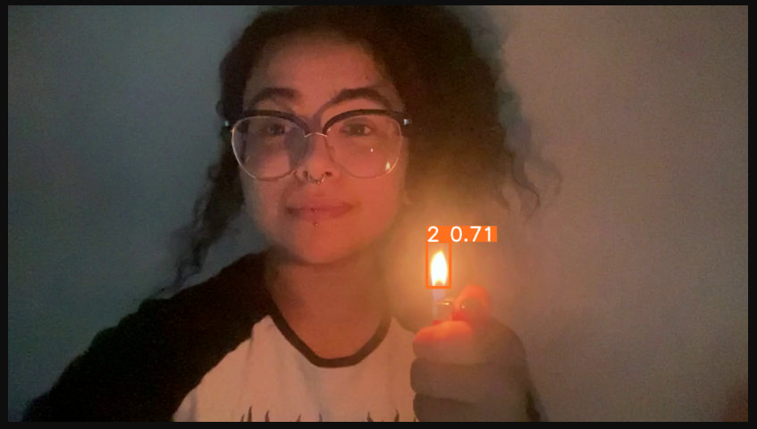

# Sistema de Visão Computacional 

## Objetivos do Projeto 
Capacidade demonstrável de interagir com imagens utilizando os conceitos de visão computacional e modelos preditivos pré-treinados. E aplicar esse modelo em vídeos ou registros de imagem utilizando de rotas de backend para armazenamento tanto local quanto online das imagens.  

## Ultralytics - YoloV8
YOLO, que significa "You Only Look Once", é uma popular arquitetura de modelo pré-treinada para detecção de objetos. O YOLO reconhece objetos em uma imagem e classifica-os, além de fornecer a localização desses objetos através de "bounding boxes". O modelo foi projetado para ser extremamente rápido e preciso, fazendo dele uma escolha ideal para aplicações em tempo real.

## Roboflow
O Roboflow é uma plataforma online que permite que desenvolvedores criem seus próprios aplicativos de visão computacional. Ele fornece várias ferramentas necessárias para converter imagens em um modelo de visão computacional com treinamento personalizado para uso em aplicativos.

## OpenCV
OpenCV (Open Source Computer Vision Library) é uma biblioteca de código aberto amplamente utilizada para processamento de imagens e visão computacional. Ela fornece um conjunto abrangente de funções e algoritmos otimizados para executar tarefas relacionadas à análise, manipulação e compreensão de imagens e vídeos.

## FastAPI
O FastAPI é um framework moderno e de alto desempenho para desenvolvimento de APIs em Python. Ele foi projetado para ser fácil de usar, rápido e altamente produtivo.

O FastAPI utiliza o tipo de anotação de tipos do Python 3.7+ para definir os tipos de dados esperados nas rotas da API, permitindo a validação automática dos dados de entrada e fornecendo mensagens de erro descritivas em caso de problemas. 

## SupaBase
O Supabase é uma plataforma de desenvolvimento de aplicativos de código aberto que combina um banco de dados PostgreSQL com uma API RESTful pronta para uso. Ele oferece recursos avançados, como autenticação, armazenamento de arquivos, geração de APIs, websockets em tempo real e muito mais.

### Criação de Dataset 
Para desenvolver a aplicação de aprendizado de máquina para o projeto eu criei um projeto individual no Roboflow para entender como estruturar um dataset. Usando como referência um dataset pre-pronto de imagens de gatos separadas por treino, teste e validação. Fiz o upload desse dataset no Roboflow para utilizar meu projeto e meu dataset como referência para a entrega. 

[Link para o Projeto](https://universe.roboflow.com/gabrielainteli/fire_detection-ihaqe/dataset/2)

## Requisitos
✓ Ultralytics 
✓ Roboflow 
✓ FastAPI  
✓ Uvicorn  
✓ Postman - Teste de Funcionamento  
✓ OpenCV  
✓ YoloV8 
✓ SupaBase   

## Passo a Passo 
1. Criação de Conta no Roboflow 
2. Criação de Dataset no Roboflow 
3. Instalação de Pacotes e Bibliotecas Necessários 
4. Treinamento e Teste do Modelo (Colab - https://colab.research.google.com/drive/1T-39zHE5GTS8R1S-QgunPcdgyicq0w2Z?usp=sharing)
5. Criação de Publisher - Realiza o envio de todos os frames de um vídeo para o nosso subscriber. 
6. Criação de Subscriber - Responsável por receber cada um dos arquivos de imagens e converter esses arquivos no formato desejato, além da conexão com a rota de backend para o armazenamento local de todas as imagens geradas. 
7. Criação de Um Bucket - Armazenamento de Imagens online com Supabase 
8. Envio das Imagens para o SupaBase - Via Rota com FastAPI 
9. Validação das Imagens via URL do Supabase 

## APIs - Servidor com FastAPI 

### Rota `/list`

Lista todas as imagens do Bucket.

#### Método
`GET`

#### URL
`/list`

#### Resposta de Sucesso
- Código: `200 OK`
- Conteúdo: Lista de imagens presentes no Bucket

---

### Rota `/upload`

Faz o upload de uma imagem para o servidor.

#### Método
`POST`

#### URL
`/upload`

#### Parâmetros da Requisição
- `content`: Arquivo de imagem a ser enviado (tipo: arquivo)

#### Resposta de Sucesso
- Código: `200 OK`
- Conteúdo:
  - `status`: "ok"

---

### Rota `/images`

Faz o upload de todas as imagens presentes na pasta `../../../OpenCV/recebidos` para o servidor.

#### Método
`POST`

#### URL
`/images`

#### Resposta de Sucesso
- Código: `200 OK`
- Conteúdo:
  - `message`: "Image uploaded successfully"

---

## Demonstração 
### Modelo - Treino e Teste 

### Funcionamento 
 

[Vídeo de Demonstração do Funcionamento](https://youtu.be/OF1IXWf8eNA) 

#### Acessar URL de Imagem Armazenada Via SupaBase 
 

